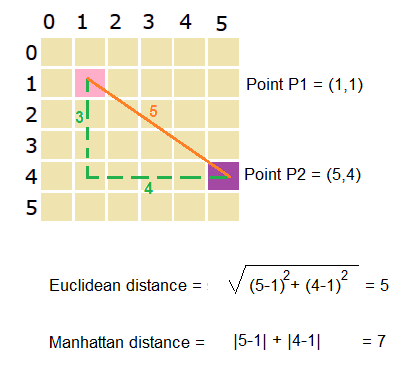

```{r setup, include=FALSE}

# Make sure every package is installed
for(this_package in c("data.table",
                      "tidyverse",
                      "readxl",
                      'lsa',
                      'udpipe',
                      'Matrix',
                      "rstudioapi",
                      'magrittr',
                      'knitr',
                      'gfortran',
                      'here',
                      'text2vec',
                      'rprojroot',
                      'ggplot2',
                      'graphlayouts',
                      'tufte',
                      'pak')){
  if(!this_package %in% installed.packages()){
    install.packages(this_package,
                     repos = "http://cran.us.r-project.org")
  }
}
#pak::pak('thomasp85/tidygraph')
#pak::pak('thomasp85/ggraph')
#pak::pak("igraph/rigraph")
library(text2vec)
library(magrittr)
library(udpipe)
library(lsa)
library(Matrix)
library(data.table)
library(ggplot2)
library(graphlayouts)

knitr::opts_chunk$set(echo = TRUE)
here::i_am(path = 'scripts/3_bivariate_analysis.Rmd')

```

# Introduction

Distributional semantic models derive from the pragmatist and differential conception of meaning advocated by Harris' distributionalist linguistics, which conceives semantics on the basis of syntagmatic (neighbors) and paradigmatic (synonyms) relationships defined by the co-occurrence relationships between terms. within real linguistic contexts. This particular conception of semantics found its most succinct expression, known and cited in the distributional hypothesis, which states that "words that are found in similar contexts of appearance tend to have similar meanings" [@heylen2016, p.54]. These ideas were implemented for the first time in the SMART system, an information retrieval system based on the vectorization of lexical frequencies of documents in a corpus and the calculation of semantic similarity/distance relationships between vectorized documents on the basis of a modified version of the distributional hypothesis, stating that "documents with similar vectors in a textual frequency matrix tend to have similar meanings" [@turney2010, p. 153, free translation]. The vector modeling procedure developed for the SMART system, taken up, improved, deepened then extended by all the distributional semantic models developed since, will be the subject of this course segment.

# Unités et domaines d'information

We would like to mention here that since distributional semantic models are used in several domains and under a multiplicity of names, it is therefore hardly surprising that the terminology relating to them is just as diverse. As part of this course, we thought it would be good to introduce you to the terminology advocated for several years by the Cognitive Information Analysis Laboratory (LANCI) and its collaborators, terminology which also enjoys a long tradition in the French-speaking scientific literature [@biskri2006; @collard2004; @collard2005; @biskri2010; @hajji2003; @ghedira2002; @rupture2008; @gargouri2009; @rupture2007; @chartier2010; @chartier2010b; @chartier2011; @meunier2005; @danis2012; @biskri2012; @biskri2013; @biskri2002; @saintemarie2011; @saintemarie2010; @forest2004; @forest2005]. This terminology is based on the use of two fundamental concepts of the semantic corpus modeling process, namely information units (*information unit, unit of information*) and information domains (*information domain, domain of information *).

A concept from information and communication technologies, the information unit represents here the basic element of the vector modeling process, the one whose co-occurrence relationships will be recorded then compiled in the different cells of the frequency matrix. If the basic unit of information is undoubtedly the word, a host of other units can also be selected and modeled. The concept of information domain refers to the semantic context, in other words to the type of environment within which the co-occurrences between the chosen information units are recorded and compiled. In the case of the Salton SMART model, the basic information domain is the document, but many other types of domain are also possible: tweets, sentences, conversational or telephone interventions, paragraphs, pages or sites web, sections, chapters and so on. Taken jointly, units and domains of information thus form a very general theoretical framework, capable of covering most cases of use of distributional semantic models.

# Génération de matrices

Considered as a whole, distributional semantic modeling relies on the generation of two types of matrices, namely frequency matrices and similarity matrices. Firstly, each information domain of the corpus is searched and the frequencies between units co-occurring within it are compiled so as to obtain a lexical distribution for each information domain; then, a frequency matrix representing the overall distribution of information units within the different information domains of the corpus is generated. Based on the distinction between units and information domains presented above, four types of frequency matrices can be generated:

- Domain-unit matrix:
  - The vectorized entities are the information domains
  - Each row vector of the matrix represents a distinct information domain of the corpus
  - Each column dimension of a vector corresponds to a distinct information unit of the corpus
  - The value of each cell is based on the number of information units of the corresponding column within the information domain of the corresponding row
  - Any manipulation or comparison of vectors concerns the information domains
- Unit-domain matrix
  - The vectorized entities are the units of information
  - Each row vector of the matrix represents a distinct unit of information from the corpus
  - Each column dimension of a vector corresponds to a distinct information domain of the corpus
  - The value of each cell is based on the number of information units of the corresponding row within the information domain of the corresponding column
  - Any manipulation or comparison of vectors concerns the units of information
- Unit-unit matrix
  - The vectorized entities are the units of information
  - Each row vector of the matrix represents a distinct unit of information from the corpus
  - Each column dimension of a vector corresponds to a distinct information unit of the corpus
  - The value of each cell is based on the number of co-occurrences of the unit of the corresponding row with the unit of the corresponding column within the different information domains of the corpus
  - Information domains are not represented explicitly
  - The matrix is ​​symmetrical
- Domain-domain matrix
  - The vectorized entities are the information domains
  - Each row vector of the matrix represents a distinct information domain of the corpus
  - Each column dimension of a vector corresponds to a distinct information domain of the corpus
  - The value of each cell is based on the number of distinct information units shared by the domain of the corresponding row and the domain of the corresponding column for all the information units present in the corpus
  - Information units are not represented explicitly
  - The matrix is ​​symmetrical

From the generation of domain-unit and unit-domain frequency matrices, similarity matrices can subsequently be generated from the application of any similarity measure to each pair of vectors in the matrix. The result of this operation is a symmetric matrix with a structure similar to the unit-unit and domain-domain type frequency matrices presented above.

These two steps are not self-evident, however, since the accomplishment of each is based on prior parameterization choices. In the case of frequency matrices, it is a question of choosing not only the types of information units, information domains and frequency matrix to model, but also the type of frequency to compile; these can be raw frequencies, but also weighted frequencies, normalized frequencies and normalized weighted frequencies. Regarding the generation of similarity matrices, the main decision consists of the selection of a similarity measure to apply on all the vectors of the corpus. For each of these decisions, several options are available to the researcher, and the choice of a particular modeling strategy depends on several factors, including the type of corpus being modeled and the researcher's priorities and objectives. These different stages and modeling alternatives as well as the choices they imply will be addressed in turn in the context of the following scripts.

## Frequency Matrix Generation

The first step in the distributional semantic modeling process consists of the generation of frequency matrices. This course segment will be an opportunity for you to get a first introduction to the generation of frequency matrices, first of all, but also to take a more in-depth look at the *text2vec* library, which will be of great benefit to you. very useful for the other workshops in this course.

To make it easier to return to the text, we thought it would be useful to use here a reduced but representative version of the corpus, containing only the titles of the articles. The titles being semantically related to the articles which they summarize in a certain way, you will therefore be able to more easily understand the different stages of the modeling process, to the extent that the titles facilitate both the return to the text and the analysis of the results.

```{r import_corpus, results = 'hide'}

#corpus <- data.table::fread('data/corpus.txt',
                            #sep = '\t')

```

# Generation of frequency matrices

While documents in PDF format take up more disk space than their equivalent in text format, co-occurrence matrices are nevertheless the least voracious textual data structures, given their sparse nature. However, as R creates a copy of an object before each modification (**copy-on-modify semantics** in English), generating a textual matrix can be costly in both time and processing space. Indeed, the entire corpus must be recorded in working memory prior to the creation of the vectors, which can double and even quadruple the amount of memory used for vectorization. To overcome this problem, the *text2vec* package offers an interesting strategy, based on the use of iterators. We will see what this consists of later.

Let's start with a review of the vectorization process presented at the end of the course on pre-processing. In linear algebra, a vector is an ordered set of values ​​describing the relative positioning of a point in a space, at the rate of one value per dimension of this space. In this sense, vectorizing a corpus consists of a sort of quantification of its textual content. This quantification is obtained by the segmentation and extraction of units and domains of information from the corpus, which are then used to define the vectors and dimensions of this space, or vice versa. Let's first segment and annotate the corpus using *Udpipe*, then convert the resulting data structure into a data.table.

```{r pos, results = 'hide'}

# data(stopwords_fr)
# 
# model_path <- '/cloud/project/data/Udpipe_model'
# 
# if (!dir.exists(model_path)) {dir.create(model_path)}
# 
# udtarget <- udpipe_download_model(language = "french-gsd",
#                                   model_dir = model_path)
# udmodel <- udpipe_load_model(file = udtarget$file_model)
# 
# titres_pos <-
#   udpipe_annotate(udmodel,
#                   titres$Title,
#                   doc_id = titres$ID,
#                   parallel.cores = 4) %>%
#   data.table::as.data.table(titres)
# 
# titres_pos

```

Let's then proceed to pre-process the corpus using the different operations presented in the pre-processing course.

```{r cleaning, results = 'hide'}

# titres_pos_clean <- titres_pos
# 
# # élimination des colonnes non nécessaires
# titres_pos_clean <- titres_pos_clean[, .(doc_id, sentence, token, lemma, upos)]
# 
# # élimination des termes non-étiquetés
# titres_pos_clean <- titres_pos_clean[!is.na(upos)]
# 
# # sélection des catégories grammaticales à retenir
# titres_pos_clean <- titres_pos_clean[upos %in% c('VERB','NOUN','ADJ','ADV','PROPN')]
# 
# # ajout des étiquettes aux termes et lemmes convertis en minuscules
# titres_pos_clean <- titres_pos_clean[, c('token',
#         'lemma',
#         'upos') := .(paste(tolower(token), upos, sep = '_'),
#                      paste(tolower(lemma), upos, sep = '_'),
#                      NULL)]
# 
# # ajout de l'attribut unif, lequel contient un vecteur regroupant tous les termes d'un même titre
# titres_pos_clean <- titres_pos_clean[,
#     .(token = list(token), lemma = list(lemma)),
#     by = .(doc_id, sentence)]
# 
# # enregistrement du corpus annoté et nettoyé
# saveRDS(titres_pos_clean, '/cloud/project/data/titres_pos_clean.RDS')

```

The *itokens* function of the *text2vec* library then allows you to iterate over the lexical occurrences of the corpus. For your information, all *text2vec* functions whose name begins with *create* rely on the use of iterators created by the *itokens* function, iterators allow spatially frugal generation of data structures. The *itokens* function also includes a series of arguments allowing pre-processing operations (*preprocessing* arguments), segmentation (*tokenizer* argument) and partitioning (*nchunks*) operations to be carried out on the fly. ; however, they will not be discussed here.

```{r itérateur}

# iter <- text2vec::itoken(titres_pos_clean$token,
# # Identication des domifs au moyen de l'identifiant des articles
#                          ids = titres_pos_clean$doc_id,
# # Désactivaction de la barre de progression pour des raisons esthétiques
#                          progressbar = FALSE)

```

One of the iterative functions of *text2vec*, *create_vocabulary* allows you to extract lexical types from the document one by one, assign them a unique identifier and generate their statistical distribution. As part of this demonstration, we will use as a unit of information the terms contained in the *token* column of the *titles* file. Another function of *text2vec*, *prune_vocabulary*, allows you to perform additional pruning of lexical types in the corpus on an effective (count) or frequency (proportion) basis. To the extent that very or very infrequent terms do not constitute good statistical discriminators, this type of pruning makes it possible to reduce not only the statistical noise, but also the size of the lexicon and that of the resulting frequency matrix, which can result in significant performance gains. In the present case, we decided to keep any unit of information appearing at least twice in the corpus (argument *term_count_min*) as well as those appearing in at least two different domains (argument *doc_count_min*).

```{r vocabulaire, results = 'hide'}
# 
# vocab <- text2vec::create_vocabulary(iter,
#                               ngram=c(ngram_min = 1,
#                                       ngram_max = 1))
#                               
# vocab <- text2vec::prune_vocabulary(vocab,
#                              term_count_min = 2,
#                              term_count_max = Inf,
#                              doc_proportion_min = 0.0001,
#                              doc_proportion_max = 0.5,
#                              doc_count_min = 2,
#                              doc_count_max = Inf,
#                              vocab_term_max = Inf)
# 
# vocab <- data.table::setDT(vocab)
# vocab

```

As you can notice, the first 4 filtered terms constitute anomalies. This type of situation is practically inevitable; any computer-assisted text analysis cannot actually be carried out without manual cleaning of the lexicon.

```{r vocab_manuel, results = 'hide'}

# vocab <- vocab[!term %chin% c('-e_NOUN',
#                               '-l-e_NOUN',
#                               '-n_ADV',
#                               '-s_ADJ')]
# vocab

```

## Matrice domaine-unité

Once the vocabulary has been cleaned and filtered, different matrix generation procedures make it possible to transpose the corpus into a vector space. The first type of matrix, the oldest, constitutes a generalization of the vector model implemented by Gerard Salton and his colleagues in the SMART system [@salton1975]. To generate this type of matrix, it suffices to convert each information domain into a vector and each distinct information unit of the corpus into the dimension of the vector space, then to assign, for each dimension unit of each domain vector , the value corresponding to the number of times the corresponding unit appears in the domain in question. In this type of matrix, co-occurrence relationships between units are not represented explicitly, but are indirectly present in the co-inclusion of units within domains.

After building the vocabulary, the *vocab_vectorizer* function allows you to create an object defining the procedure for converting lexical types into indices or matrix dimensions. The *ngram* parameter of this function allows you to specify the type of n-grams of words to consider. Finally, the *create_dtm* function uses this lexical vectorizer and the iterator created previously to generate a domain-unit type frequency matrix.

```{r vectorisation}


# vectorizer <- text2vec::vocab_vectorizer(vocab)
# 
# termes_d_u <- text2vec::create_dtm(iter,
#                                    vectorizer,
#                                    type = "dgCMatrix")
# 
# saveRDS(object = termes_d_u,
#         file = '/cloud/project/data/matrices_titres/fréquences/titres_tokens_freq.Rds')
# 
# str(termes_d_u)
```

The data structure of the matrix, inherited from the *Matrix* library, is of type *dgCMatrix* (for **digital** ). The product file contains 6 boxes (**slots**). *Dim* contains the dimensions of the matrix, with 6424 document rows and 542 column terms. The *x* box gives the non-zero values ​​of the matrix in columnar order (top to bottom, then left to right). Box *i* gives the row index for each value in box *x*, while box *p* is the cumulative sum of non-zero values ​​per column; this system allows you to avoid specifying the column index of each non-zero value; in the case of large matrices, this system allows much more economical encoding. Finally, the *Dimnames* box returns the names of the rows (here, the documents) and the columns (here, the terms) of the matrix. The following tests allow you to check whether the order of documents and terms is respected.

```{r names_test}

# identical(rownames(termes_d_u), titres_pos_clean$doc_id)
# identical(colnames(termes_d_u), vocab$term)
```

The following test, a little more sophisticated, allows you to check whether the vectorization procedure has correctly formalized the corpus. It consists of taking the title of the first cleaned article and comparing it to the names of the columns of the first row of the matrix whose values ​​are non-zero.

```{r row_test}
 #4. Pour avoir un aperçu des données. On utilise apply() sur la matrice titres_pos_clean transposé avec la fonction t().
# CE N'EST PAS NÉCESSAIRE DE COMPRENDRE CETTE LIGNE DE CODE. Elle nous sert seulement à des fins pédagogiques.
# apply(t(termes_d_u[1,]), 1, function(x) x[x == TRUE])
# 
# # solution 2
# termes_d_u[1, termes_d_u[1,] == TRUE]
```

## Matrice unité-domaine

If the SMART model of Salton and his colleagues essentially had the function of measuring the similarity between information domains of a corpus, it is also possible to use the same modeling technique for the semantic processing of information units ( words, lemmas, lexical types, lexical occurrences, n-grams of characters or words, noun phrases, etc.) [@deerwester1990]. To do this, it is enough only to transpose the domain-unit matrix so as to obtain a unit-domain matrix, in which each distinct information unit is represented by a vector whose dimensions and values ​​respectively represent the different domains information of the corpus and the number of occurrences of the unit in question in the corresponding information domain. Here too, co-occurrence relationships between units are not represented explicitly, but are indirectly present in the co-inclusion of units within domains.

The previous course segment on vectorization showed you how it is possible to generate these matrices by transposition, i.e. using the *t()* function of the *Matrix* library. This function consists, so to speak, of generating a new matrix whose rows correspond to the columns of the previous one and vice versa. Calling the function will allow you to confirm this.

```{r 4.2.1 matrice_d_u}

# termes_u_d <- Matrix::t(termes_d_u)
# str(termes_u_d)
# saveRDS(object = termes_u_d,
#         file = '/cloud/project/data/matrices_titres/fréquences/tokens_titres_freq.Rds')

```

Representing each distinct unit of the corpus as a vector whose dimensions correspond to the different information domains in which it appears generates vector models allowing different operations to be performed on these units. Most of the applications of this type of model concern the semantic processing of words. If the oldest and known of them aim to carry out different synonymous tasks [@deerwester1990; @landauer1997; @rapp2004], unit-domain matrices have also proven their usefulness in different classification and grouping tasks, notably for semantic labeling purposes [@erk2007; @pennacchiotti2008; @turney2003], sentiment analysis, automatic thesaurus generation [@crouch1988; @grefenstette2012] [@ruge1997; @pantel2002; @curran2002] and lexical disambiguation [@schutze1998; @pantel2002; @pereira1993; @agirre2007; @pedersen2007; @leacock1993; @yuret2010].

## Matrice unité-unité

Finally, the third type of matrix is ​​generated by calculating the matrix product of the unit-domain matrix by its transpose, the domain-unit matrix. This operation can be done in two ways, both using the *Matrix* library: the first is to use operator _%\*%_ on the unit-domain and domain-unit matrices in order; the second, faster, consists of applying the *tcrossprod()* function, which performs the matrix product of a matrix and the transpose of a matrix, on the unit_domain matrix.

```{r matrices u_u}

# identical(as.matrix(termes_u_d %*% termes_d_u),
#           as.matrix(Matrix::tcrossprod(termes_u_d)))

```

```{r matrices u_u PROPOSITION}

# matrice_mots_mots <- as.matrix(Matrix::tcrossprod(termes_u_d))

```


The result is a matrix having as rows and columns the different units of information present in the corpus and whose values ​​represent the number of times where two units of information co-occur within the different information domains of the corpus. In this type of matrix, co-occurrence relationships are represented explicitly. What is no longer there, however, are the inclusion relations of the units in the different information domains of the corpus, these being absent from the model.

```{r 4.2.1 matrice u_u}

# Matrix::tcrossprod(termes_u_d) %>%
#   str(.)

```

```{r 4.2.1 matrice u_u2}
# str(matrice_mots_mots)
```

We will use this type of matrix as part of the script on co-occurrence networks.

## Matrice domaine-domaine

A fourth type of matrix, much less known and used, can be generated based on the anticommutativity of the matrix product. Anticommutativity is the property characterizing operations for which interchanging two arguments transforms the result into its opposite (i.e., a × b = − b × a). In the present case, such an inversion results in the creation not of a unit-unit matrix, but rather of a domain-domain matrix, whose values ​​express a co-inclusion relationship and correspond to the number of terms shared by each pair of titles. Although here again, the matrix can be generated in two different ways using the *Matrix* library, for the rest of the course we will favor the use of *tcrossprod()*.

```{r 4.2.1 matrice d_d}

# iter <- text2vec::itoken(titres_pos_clean$token,
# # identication des domifs au moyen de l'identification des articles
#                          ids = titres_pos_clean$doc_id,
# # désactivaction de la barre de progression pour des raisons esthétiques
#                          progressbar = FALSE)
# 
# text2vec::create_dtm(iter,
#                      text2vec::vocab_vectorizer(vocab),
#                      type = "dgCMatrix") %>%
#   Matrix::tcrossprod(.) %>%
#   str(.)

```

Domain-domain matrices are interesting in that by indicating the number of terms shared by two documents, they allow a first approximation of their semantic similarity. As an example, the following block of code allows you to extract the documents having the most terms in common with the title of the article *SO0329Act0263*.

```{r 4.2.1 similarités}
# 1. CREATION DE L'ITERATEUR
# iter <- text2vec::itoken(titres_pos_clean$token,
# # identication des domifs au moyen de l'identification des articles
#                          ids = titres_pos_clean$doc_id,
# # désactivaction de la barre de progression pour des raisons esthétiques
#                          progressbar = FALSE)
# 
# # 2. CREATION MATRICE
# dtm <- text2vec::create_dtm(iter,
#                      text2vec::vocab_vectorizer(vocab),
#                      type = "dgCMatrix")
# 
# 
# # 3. CREATION MATRICE MOT_MOT
# matrice_docs_docs <- Matrix::tcrossprod(dtm)
# 
# 
# # 4. selection  de la colonne correspondant au doc 'SO0329Act0263'
# vecteur_doc <- matrice_docs_docs[, 'SO0329Act0263']
# 
# # 5. Creation d'un datatable ayant une colonne appelé rn avec les rownames et une appelé 'SO0329Act0263'
# matrice_docs_docs <- data.table(rn = rownames(matrice_docs_docs), 'SO0329Act0263' = vecteur_doc)
# 
# # 6. Ajout de la liste d'occurrences (tokens) pour chaque titre
# matrice_docs_docs <- merge(x = matrice_docs_docs,
#         y = titres_pos_clean[, .(doc_id,
#                                  sentence,
#                                  token = as.character(token))],
#         by.x = 'rn',
#         by.y = 'doc_id')
#   
# # Ordonnancement décroissant des valeurs de co-inclusion
# matrice_docs_docs <- matrice_docs_docs[head(order(SO0329Act0263, decreasing = TRUE)), ]
# matrice_docs_docs
```


A few comments are in order regarding these results. First of all, it stands to reason that the title most similar to that of *SO0329Act0263* is that same title, by virtue of the identity property. Although this information does not provide much in terms of semantic analysis, it does allow us to obtain the number of filtered terms from the title of this article. This type of information can prove useful in terms of modeling, to the extent that it allows analyzes based on headcount counts to be put into perspective on the basis of the total number of units within the areas of information compared. . This type of information is all the more important because information domains rarely contain the same number of terms. So, in the case of our example, 2 titles have 2 terms in common with *SO0329Act0263*; however, *JQ0509Nou0631* only contains the two terms shared by *SO0329Act0263*, while the second contains many more. From this perspective, asserting that these two titles are also similar to *RC0214no_0003* certainly appears questionable. It is also on the basis of the total numbers of the domains compared that the Jaccard index is based, which we will see in the segment on similarity matrices.

To continue with the comparison of the two titles, another aspect which differentiates them refers to the terms which they share with *SO0329Act0263*: if both share the term *findings*, the first also contains *contested* while the second shares * offense*. However, these terms very probably do not have the same frequency elsewhere in the corpus; If one of them appeared in all areas, its presence here would not be surprising and would bring virtually no information to the comparison. To this end, remember that distributional semantic models are based on a differential conception of semantics; from this point of view, the occurrence of a term that appears everywhere else literally makes no difference.

Finally, for these two titles as for each of the comparisons made, basing a semantic comparison on a simple count does not allow us to take into account all the terms included in the titles appearing in the list but absent from *SO0329Act0263*, for example "students" for *RC0328no_0128* or "rights" and "education" for *DE0220Act0037* and *DE0221Act0041*. However, all these terms are not included in a calculation of similarity between domains based on the sole co-inclusion of units, which is certainly problematic in terms of differential semantics. However, it is possible to remedy these shortcomings by enriching the strict count of information units with mathematical normalization and weighting procedures, which will be the subject of the next segment.

## Exercices

Sur la base des scripts présentées jusqu'ici:

1. Procédez à la création des différentes matrices de fréquences (domaine-unité, unité-domaine, unité-unité, domaine-domaine) pour les occurrences (tokens) et lemmes des articles du corpus et enregistrez-les dans le sous-dossier *fréquences* du dossier *matrice_articles*. 

```{r exercice_2_1}

# Rédigez votre script ici 

```

2. D'une manière similaire à l'exemple fourni dans le cas de la matrice domaine_unité, prenez le titre du premier article nettoyé et comparez-les aux unités des rangées de la première colonne de la matrice unité-domaine dont les valeurs sont non nulles.

```{r exercice_2_2}

# Rédigez votre script ici

```

3. Vérifiez si des matrices unité-domaine générées au moyen des opérations %\*% et *Matrix::tcrossprod()* sont identiques.

```{r exercice_2_3}

# Rédigez votre script ici

```

4. D'une manière similaire à l'exemple fourni dans le cas de la matrice domaine-unité, vérifiez si l'ordre du nom des domaines et des unités est respecté. 

```{r exercice_2_4}

# Rédigez votre script ici

```

5. D'une manière similaire à l'exemple fourni pour les matrices unité-unité, vérifiez l'identité des matrices domaine-domaine créées au moyen des opérateurs _%\*%_ et *tcrossprod()*.


```{r exercice_2_5}

# Rédigez votre script ici

```


# Weighting and normalization


```{r get_corpus, include=FALSE}


# 
# titres_pos_clean <-
#   readRDS('/cloud/project/data/titres_pos_clean.RDS')
# 
# iter <- text2vec::itoken(titres_pos_clean$token,
# # identication des domifs au moyen de l'identification des articles
#                          ids = titres_pos_clean$doc_id,
# # désactivaction de la barre de progression pour des raisons esthétiques
#                          progressbar = FALSE)
# 
# vocab <-
#   text2vec::create_vocabulary(iter,
#                               ngram=c(ngram_min = 1,
#                                       ngram_max = 1)) %>%
#   text2vec::prune_vocabulary(.,
#                              term_count_min = 2,
#                              term_count_max = Inf,
#                              doc_proportion_min = 0.0001,
#                              doc_proportion_max = 0.5,
#                              doc_count_min = 2,
#                              doc_count_max = Inf,
#                              vocab_term_max = Inf) %>%
#   data.table::setDT(.) %>%
#   .[!term %chin% c('-e_NOUN',
#                    '-l-e_NOUN',
#                    '-n_ADV',
#                    '-s_ADJ')]

```

In the previous course segment, we saw how it is possible to generate different vector representations of a corpus based on frequency counts. We also showed by means of a domain-domain matrix that a calculation of similarity between domains based on the number of information units that they share does not take into account the number of total numbers for each domain. as well as the discriminating power of the units they contain and on the basis of which they are compared. In this segment we will see how these shortcomings can be addressed through weighting and standardization procedures.

## Weighting

A problem endemic to lexical distributions is related to their asymmetric nature: regardless of the unit type and information domains chosen for a model, the vast majority of unit occurrences are always the case of a minority of types. This problem may be familiar to you; in fact, it is related to "Zipf's law" that we talked about previously. With regard to modeling based on frequency counts, this distributional asymmetry means that regardless of the model, a minority of cells in the frequency matrix will necessarily share the majority of the observed numbers. In this sense, the most frequent units will tend to appear in most of the areas listed; in the context of differential semantics, this means that such units represent more noise than information when it comes to semantic similarity.

Matrix weighting aims to remedy this situation by adjusting the weight of each unit according to its information content. To the extent that surprising events shared by two vectors are better discriminators in terms of similarity than more frequent events, the weighting procedures aim to modify the unit numbers of each vector on the basis of the frequency of these units in the rest of the corpus.

The most well-known weighting technique used in the field of distributional semantic modeling is undoubtedly tf-idf (for *term frequency x inverse document frequency*). Designed by Karen Spärck Jones [-@sparck1972], tf-idf consists of normalizing the frequency of occurrence of each term within the domains of a corpus on the basis of its inverse document frequency (**inverse document frequency or IDF**). This indicator is based on the idea that the importance or informativeness of a term is inversely proportional to its presence in the entire corpus. Formally, the IDF aims to give greater weight to the least frequent terms by calculating, for each unit of the lexicon, the logarithm (in base 10 or base 2) of the inverse of the proportion of domains in the corpus containing the term:

\[IDF = \log {\frac  {\textrm{# domaines du corpus}}{\textrm{# domaines du corpus contenant l'unité}}}\]

By multiplying the frequency of each unit within each domain by the corresponding IDF value, the tf-idf thus makes it possible to adjust the weight of a unit within a domain according to its informativeness relative to the corpus analyzed. Salton and Buckley [-@salton1988] defined a large family of tf-idf type weighting functions and demonstrated that their use in weighting frequency matrices offers several advantages over raw headcounts.

The *text2vec* package allows you to weight a frequency matrix by creating a *tf-idf* model using the eponymous transformer.

```{r 4.2.1 tfidf}
# 
# tfidf_model <- text2vec::TfIdf$new(smooth_idf = FALSE,
#                                    norm = 'none',
#                                    sublinear_tf = FALSE)

```

As its name indicates, the *smooth_idf* argument makes it possible to soften the distribution of *tf-idf* scores by incrementing the inverse documentary proportion by one, as if the corpus containing an additional domain containing each unit of the lexicon only one times:

\[IDF = \log{\Bigg(1+\frac{\textrm{# corpus domains}}{\textrm{# corpus domains where the term appears}}\Bigg)}\]

As for the *norm* argument, we will return to it in the next section. Finally, the *sublinear_tf* argument allows you to soften the unit count (*term_frequency* or **tf**) by means of sublinear scaling $1 + log(tf)$. For now, let's assign the value *none* to *norm* as well as the value *FALSE* to the other two parameters, which will not be discussed here.

In order to demonstrate the usefulness of weighting techniques, let us return to the previously used case of the titles most similar to that of the article $SO0329Act0263$, calculated this time using the weighted domain-domain matrix. Attention! Any weighting and normalization operation must be carried out BEFORE the matrix product.

```{r 4.2.1 similarité_titres}
# CHARGEMENT DES TITRES
# titres <- data.table::fread('/cloud/project/data/titres.txt')
# 
# tfidf_model <- text2vec::TfIdf$new(smooth_idf = FALSE,
#                                    norm = 'none',
#                                    sublinear_tf = FALSE)
# 
# # génération de la matrice domaine-unité
# text2vec::create_dtm(iter,
#                      text2vec::vocab_vectorizer(vocab),
#                      type = "dgCMatrix") %>%
#   fit_transform(., tfidf_model) %>%
# # Produit matriciel de la matrice domaine_unité avec sa transposée
#   Matrix::tcrossprod(.) %>%
# # Conversion de la matrice creuse en matrice pleine
#   as.matrix(.) %>%
# # Conversion de la matrice pleine en data frame
#   as.data.frame(.) %>%
# # Conversion du data frame en data table avec conversion colonnaire des indices de rangées
#   as.data.table(., keep.rownames = TRUE) %>%
# # Sélection des colonnes désirées
#   .[, .(rn, SO0329Act0263)] %>%
# # Ajout de la liste d'occurrences (tokens) pour chaque titre
#   merge(x = .,
#         y = titres[, .(ID,
#                        Title)],
#         by.x = 'rn',
#         by.y = 'ID') %>%
# # Ordonnancement décroissant des valeurs de co-inclusion
#   .[head(order(SO0329Act0263, decreasing = TRUE)), ]
```


```{r 4.2.1 similarités PROPOSITION}
# 0. CHARGEMENT DES TITRES
# titres <- data.table::fread('/cloud/project/data/titres.txt')
# 
# # 1. INITIALISAITON MODEL TFIDF
# tfidf_model <- text2vec::TfIdf$new(smooth_idf = FALSE,
#                                    norm = 'none',
#                                    sublinear_tf = FALSE)
# 
# # génération de la matrice domaine-unité
# dtm <- text2vec::create_dtm(iter,
#                      text2vec::vocab_vectorizer(vocab),
#                      type = "dgCMatrix")%>%
#   fit_transform(., tfidf_model)
# 
# 
# # 3. Produit matriciel de la matrice domaine_unité avec sa transposée
# matrice_docs_docs <-  Matrix::tcrossprod(dtm)
# 
# # 4. selection  de la colonne correspondant au doc 'SO0329Act0263'
# vecteur_doc <- matrice_docs_docs[, 'SO0329Act0263']
# 
# # 5. Creation d'un datatable ayant une colonne appelé rn avec les rownames et une appelé 'SO0329Act0263'
# matrice_docs_docs <- data.table(rn = rownames(matrice_docs_docs), 'SO0329Act0263' = vecteur_doc)
# 
# # 6. Ajout de la liste d'occurrences (tokens) pour chaque titre
# matrice_docs_docs <- merge(x = matrice_docs_docs,
#         y = titres[, .(ID,
#                        Title)],
#         by.x = 'rn',
#         by.y = 'ID')
#   
# # Ordonnancement décroissant des valeurs de co-inclusion
# matrice_docs_docs <- matrice_docs_docs[head(order(SO0329Act0263, decreasing = TRUE)), ]
# matrice_docs_docs

```

The comparison of these results with those obtained previously deserves some comments. First of all, there was a switch between the 2nd and 3rd place titles. This change is a direct result of the weighting operation, which favored “infringement” at the expense of “contested”. To verify this, *text2vec* offers the possibility of obtaining the list of *idf* values ​​of the lexicon terms, although the procedure to obtain it is not very obvious. Let's just obtain the *Idf* value for the units 'findings', 'violation', 'contested' in order to validate our hypothesis, then let's add to this list the terms 'contested' and 'contest', also present in the corpus.

```{r 4.2.1 idf}
# 
# data.table::data.table(term = rownames(readRDS('/cloud/project/data/matrices_titres/fréquences/tokens_titres_freq.Rds')), idf = diag(tfidf_model$.__enclos_env__$private$idf)) %>%
#   .[term %chin% c('constats_NOUN',
#                   'infraction_NOUN',
#                   'contestés_VERB',
#                   'contestée_VERB',
#                   'contester_VERB')]

```

```{r 4.2.1 idf PROPOSITION}
# 0. chargemnt matrice
# matrice_token <- readRDS('/cloud/project/data/matrices_titres/fréquences/tokens_titres_freq.Rds')
# 
# # create data.table avec les token et leurs valeurs idf
# idf_token <- data.table::data.table(term = rownames(matrice_token), idf = diag(tfidf_model$.__enclos_env__$private$idf))
# 
# # afficher les résultats pour quelques mots
# idf_token[term %chin% c('constats_NOUN',
#                   'infraction_NOUN',
#                   'contestés_VERB',
#                   'contestée_VERB',
#                   'contester_VERB')]

```

You will notice here that the *Idf* values ​​of noted and disputed are similar. We added the terms 'contester_VERB' and 'contestée_VERB' to indicate that this equality is only relative to the modeling decisions we made previously. Indeed, if we had opted for the modeling of lemmas rather than lexical occurrences, 'contestés' and 'contestée' would have been converted to the infinitive form, which would have had the effect of increasing the total numbers of 'contester_VERB', reduce its *Idf* value and thus modify the results obtained previously. It is important to keep this type of consideration in mind during our analyses.

As for the three other titles included in the list, their rank remains unchanged, the equality still persisting between them despite their difference in size. In other words, weighting does not control for inequality in the size of information domains: weighted domains containing more units will also tend to have more units in common with any domain and therefore be more relevant to it. similar to other smaller domains, regardless of the informativeness of the shared units. The normalization techniques discussed in the next section help remedy this problem.

## Normalisation

Among the problems facing computer-assisted text analysis, those caused by differences in size between information domains in the same corpus are among the oldest, recurring and stubborn. Regardless of the corpus as well as the type of information domain chosen, very few modeled domains are of the same length; some of them can be much larger than others and thus have more extensive vectors than those representing contexts of smaller size. However, given the differential nature of vector semantics, such a size variation can have an effect on distance calculations and distort your distance matrix, a bit like distorting mirrors. It has also been shown in information retrieval that search engines have a favorable bias towards longer documents [@Singhal1996].

A term with multiple meanings and uses, the term "normalization" generally refers in mathematics, statistics and metrology to various procedures for adjusting values ​​for the purposes of standardization or with a view to conferring representativeness and good form to the data. In the field of linear algebra, however, the term refers to a particular operation, consisting of assigning an extent or length to the various elements of a vector space. Formally, a norm is a function which assigns a positive real to a vector on the basis of certain formal properties (absolute homogeneity and triangular inequality), except for the zero vector, which is assigned a zero value (0).

The concept of norm is of great importance in distributional semantic modeling as in computer science in general. Remember that a semantic-vector space constructed based on the principles and procedures presented so far is a set of points in a multidimensional space; we represent them by straight lines or arrows for reasons of understanding and visibility, but they are not part of this space in its raw form. To include them, it is necessary to standardize this space, in other words to provide it with a function allowing a magnitude to be assigned to the vectors it contains and which makes it possible to know its length and direction and thus to measure it. If the length of a vector does not matter to us -- in fact, this is precisely what we want to neutralize given the inequality in size of the information domains in our corpus -- it is quite another matter the direction, because it is this which indicates to us the "meaning" (pardon the pun) of our vector, the sector of the semantic space towards which it tends. However, to isolate this vector direction, it suffices to convert the vectors populating the space into unit vectors, that is to say into co-linear vectors (in the same direction as the original vector) whose norm has a length of 1.


Formally, the normalized vector $\hat{u}$ of a non-zero vector $u$ is the unit vector co-linear with $u$ and obtained as follows:

\[\mathbf {\hat {u}} ={\frac {\mathbf {u} }{|\mathbf {u} |}}\],

where $|u|$ is the norm (or length) of $u$. The term "normalized vector" is often used synonymously with "unit vector". In other words, to convert a vector into a unit vector (or direction vector), it is simply necessary to divide it by its norm, in other words to divide each of the values ​​of its non-zero dimensions (each coordinate) by the length of the vector.

In the context of distributional semantics, the use of unit vectors makes it possible to neutralize the effect of domain size. Since all vectors are at the origin and the length of each vectorized domain is the same, the only remaining element for calculating similarity is the distance resulting from the difference in direction, as in the following example.

{style="display: block; margin: 0 auto"}

Obviously, the type of unit vector space obtained depends on the norm chosen. Theoretically, there are an (uncountable) infinity of ways to normalize a vector space. This infinity is well highlighted by the Minkowski metric, a parametric equation generalizing the mathematical concept of norm:

\[\left(\sum _{i=1}^{n}|x_{i}-y_{i}|^{p}\right)^{\frac {1}{p}}\]

The infinity of normalization possibilities results from the infinity of values ​​attributable to the parameter *p* (non-countable infinity in the case of real numbers). Fortunately, for distributional semantic models and most computer applications, two norms are generally used: the rectilinear norm (L1), for which $p=1$, and the Euclidean norm (L2), $p=2$.

Used in regression analysis since the 18th century, the rectilinear norm, also called Manhattan norm, City-Block norm, taxicab norm, represents the 1-distance (for $p=1$) derived from the Minkowski metric and corresponds to the sum of absolute differences of all coordinates of the compared vectors:

\[\left(\sum _{i=1}^{n}|x_{i}-y_{i}|^{p\rightarrow1}\right)^{\frac {1}{p\rightarrow1}} = \sum^{n}_{i=1} | x_i - y_i |\]

The different names of this measurement allude to the grid structure of the space thus standardized: this norm in fact assigns magnitudes to the vectors or to each other in a manner which is reminiscent of the trajectory followed by vehicles within of the Hippodamian or checkerboard structure of modern urban cities, made of right angles and perpendicular segments.

More used than the previous one, the Euclidean distance or L2 norm represents the 2-distance (for $p=2$) derived from the Minkowski metric and corresponds to the application in a vector context of the Pytagorean theorem. This theorem, probably one of the best known in all of mathematics, relates the lengths of the sides in a right triangle. It states that the square of the length of the hypotenuse, which is the side opposite the right angle, is equal to the sum of the squares of the lengths of the other two sides. The formal version of this theorem, called the "Pythagorean equation", is written as follows:

\[a^{2}+b^{2}=c^{2},\]

where $c$ represents the length of the hypotenuse and $a$ and $b$ the lengths of the other two sides of the triangle.

This theorem has been the subject of numerous proofs and geometric or algebraic extensions over time, probably more than any other theorem. In a vector and semantic-vector context in particular, it makes it possible to measure space by treating any pair of vectors and the length that unites them as Pythagorean triples:

\[d(x,y)=\left(\sum _{i=1}^{n}|x_{i}-y_{i}|^{p\rightarrow2}\right)^{\frac {1}{p\rightarrow2}} = \sqrt{\sum^{n}_{i=1} (x_i - y_i)^2 }\]

The difference in the calculation of the two standards is well illustrated by the following example:

{style="display: block; margin: 0 auto"}

Each in their own way, these two standards make it possible to convert a vector space into a unit vector space, by transforming each vector by division into a vector with the same direction and length 1, as defined by the standard in force. The *text2vec* library allows you to normalize the frequency matrices previously generated using L1 or L2 in two different ways: using the *normalize* function or by modifying the normalization parameter of the *tfidf* transformer previously described. To better understand the impact of this transformation, let's first start by looking again at the case of the article titles most similar to *DE0221Act0041*, analyzed this time using an unweighted frequency matrix and L2- normalized using the *normalize* function.

```{r 4.2.1 normalization1}
# # 0. CHARGEMENT DES TITRES
# titres <- data.table::fread('/cloud/project/data/titres.txt')
# 
# # 2. génération de la matrice domaine-unité
# dtm <- text2vec::create_dtm(iter,
#                      text2vec::vocab_vectorizer(vocab),
#                      type = "dgCMatrix")
# 
# # 3 Normalisation
# dtm <- text2vec::normalize(dtm, norm = "l2")
# 
# # 4. Produit matriciel de la matrice domaine_unité avec sa transposée
# matrice_docs_docs <-  Matrix::tcrossprod(dtm)
# 
# # 5. selection  de la colonne correspondant au doc 'SO0329Act0263'
# vecteur_doc <- matrice_docs_docs[, 'SO0329Act0263']
# 
# # 6. Creation d'un datatable ayant une colonne appelé rn avec les rownames et une appelé 'SO0329Act0263'
# matrice_docs_docs <- data.table(rn = rownames(matrice_docs_docs), 'SO0329Act0263' = vecteur_doc)
# 
# # 7. Ajout de la liste d'occurrences (tokens) pour chaque titre
# matrice_docs_docs <- merge(x = matrice_docs_docs,
#         y = titres[, .(ID,
#                        Title)],
#         by.x = 'rn',
#         by.y = 'ID')
#   
# # Ordonnancement décroissant des valeurs de co-inclusion
# matrice_docs_docs <- matrice_docs_docs[head(order(SO0329Act0263, decreasing = TRUE)), ]
# matrice_docs_docs
```

If *SO0329Act0263* still represents the most similar item, *JQ0509Nou0631* and *RC0328no_0128* have swapped their positions again, although radically this time, since an impressive gap now separates the second rank from the third. Indeed, *JQ0509Nou0631* obtains a high score to the extent that the two units it contains are among the units contained in *SO0329Act0263*; conversely, *RC0328no_0128* contains several terms which are not included in *SO0329Act0263* and vice versa, which has the effect of separating them more than in a non-standardized context. Another important effect, neutralizing the effect of domain size broke the tie in force at 3rd place. You will notice that the third goes back to *SO0525Act0912*; having only "observations" in common with *SO0329Act0263*, it is however much shorter than the other two titles, so that the direction of the vector which corresponds to it is less "diverted" by all the units which are not not shared. Finally, if *DE0220Act0037* and *DE0221Act0041* have the same number of units shared with *SO0329Act0263*, the second however has one (unshared) term more than the first, hence their classification. Overall, this example clearly shows the impact of neutralizing the size effect made possible by standardization, making it an essential complement to weighting. The next section will focus on the joint use of these procedures in the context of computer-assisted textual analysis.

## Pondération, puis Normalisation

If you have paid attention to the content of the previous sections so far, I also invite you to note their order. This order of presentation is not random but on the contrary respects the order of the processing procedures. Indeed, weighting must always be carried out BEFORE normalization. The reason for this is very simple: to the extent that normalization converts all vectors into unit vectors in order to neutralize variation in the size of information domains, weighting vectors after having normalized them only reintroduces vector length into the process. modeling.

The *Tfidf* transformer of the *text2vec* library makes it possible to avoid such an error, to the extent that the *norm* parameter of this transformer allows unitary normalization to be carried out automatically, prior to the weighting of the vectors. Let's start by defining a new transformer *tfidf*, taking care to set the parameter *norm* to L2, then let's apply it to the case of the article titles most similar to $SO0329Act0263$, this time taking the field of analyzes the weighted and l2-normalized domain-domain matrix of the subcorpus of article titles.

```{r 4.2.1 similarités_tfidf_l2}

# titres <- data.table::fread('/cloud/project/data/titres.txt')
# 
# # 1. INITIALISAITON MODEL TFIDF
# tfidf_model <- text2vec::TfIdf$new(smooth_idf = FALSE,
#                                    norm = 'none',
#                                    sublinear_tf = FALSE)
# 
# # 2. génération de la matrice domaine-unité
# dtm <- text2vec::create_dtm(iter,
#                      text2vec::vocab_vectorizer(vocab),
#                      type = "dgCMatrix")%>%
#   fit_transform(., tfidf_model)
# 
# # 3 Normalisation
# dtm <- text2vec::normalize(dtm, norm = "l2")
# 
# # 4. Produit matriciel de la matrice domaine_unité avec sa transposée
# matrice_docs_docs <-  Matrix::tcrossprod(dtm)
# 
# # 5. selection  de la colonne correspondant au doc 'SO0329Act0263'
# vecteur_doc <- matrice_docs_docs[, 'SO0329Act0263']
# 
# # 6. Creation d'un datatable ayant une colonne appelé rn avec les rownames et une appelé 'SO0329Act0263'
# matrice_docs_docs <- data.table(rn = rownames(matrice_docs_docs), 'SO0329Act0263' = vecteur_doc)
# 
# # 7. Ajout de la liste d'occurrences (tokens) pour chaque titre
# matrice_docs_docs <- merge(x = matrice_docs_docs,
#         y = titres[, .(ID,
#                        Title)],
#         by.x = 'rn',
#         by.y = 'ID')
#   
# # Ordonnancement décroissant des valeurs de co-inclusion
# matrice_docs_docs <- matrice_docs_docs[head(order(SO0329Act0263, decreasing = TRUE)), ]
# matrice_docs_docs
```


The result of these operations strongly resembles that obtained by simple l2-normalization: $SO0329Act0263$ is the most similar to itself, followed closely by $JQ0509Nou0631$. As in the case of the example with simple weighting, the gap between these two titles and the others is accentuated by the greater weight given to the term "contested", with the difference however that the length of the titles is neutralized by the use to unit vectors. The similarity calculation is therefore solely based on the vector directions, adjusted by the informative value of the units which orient it.

In short, a weighted and then normalized domain-domain matrix allows a finer measurement of the semantic similarity between information domains and in this sense represents an improvement of the frequency counting modeling process presented in the previous script. The use of the term “measure” here is not innocent. Indeed, the generation of a domain-domain matrix by means of the matrix product of l2-normalized domain-unit and unit-domain matrices is in itself a dissimilarity matrix, to the extent that this operation is mathematically equivalent to application on this same domain-unit matrix of a particular dissimilarity measure, namely the cosine. Such equivalence also applies in the context of the generation of unit-unit matrices by matrix product of l2-normalized unit-domain and domain-unit matrices. It is to this measurement as well as to the generation of similarity matrices in general that the next script is devoted.

## Exercices

1. La librairie *text2vec* permet de pondérer et normaliser une matrice de fréquences de deux manières: par l'application successive du transformateur *TfIdf* et de la fonction *normalize*, puis par simple application du transformateur *TfIdf* avec le paramète *norm* fixé à 'l2'. Démontrez l'identité des matrices générées de cette manière au niveau des 4 différents types de matrices de fréquences présentés dans ce cours (domaine-unité, unité-domaine, unité-unité et domaine-domaine). 

```{r exercice_3_1}

# Rédigez votre script ici

```

2. Reprenez les différentes procédures de comparaison (pour fréquences brutes, fréquences pondérées, fréquences normalisées puis fréquences pondérées normalisées) de domaines présentées dans le cadre du présent script et appliquez-les à un document de votre choix (autre que *SO0329Act026*).

```{r exercice_3_2}

# Rédigez votre script ici

```

# Similarity matrices

```{r get_corpus2, include=FALSE}
# 
# titres_pos_clean <-
#   readRDS('/cloud/project/data/titres_pos_clean.RDS')
# 
# iter <- text2vec::itoken(titres_pos_clean$token,
# # identication des domifs au moyen de l'identification des articles
#                          ids = titres_pos_clean$doc_id,
# # désactivaction de la barre de progression pour des raisons esthétiques
#                          progressbar = FALSE)
# 
# vocab <-
#   text2vec::create_vocabulary(iter,
#                               ngram=c(ngram_min = 1,
#                                       ngram_max = 1)) %>%
#   text2vec::prune_vocabulary(.,
#                              term_count_min = 2,
#                              term_count_max = Inf,
#                              doc_proportion_min = 0.0001,
#                              doc_proportion_max = 0.5,
#                              doc_count_min = 2,
#                              doc_count_max = Inf,
#                              vocab_term_max = Inf) %>%
#   data.table::setDT(.) %>%
#   .[!term %chin% c('-e_NOUN',
#                    '-l-e_NOUN',
#                    '-n_ADV',
#                    '-s_ADJ')]

```


The linguistic distributionalism of Zellig Harris, from which distributional semantic models are inspired, advocates a differential and non-referential conception of semantics. According to this interpretation, the signifying function of a word does not rest on a direct and abstract relationship of correspondence with the world of ideas and concepts, but rather is based on syntagmatic and paradigmatic relationships, which emerge from co-occurrence relationships. resulting from the sequential development of the linguistic chain and determine the meaning of a word through its use, either from the other words forming its context of occurrence as well as those that can be substituted for it at this precise location in the chain respectively. In other words, a word means nothing in itself, because our utterances and the words that compose them only convey meaning collectively, in relation to each other: the meaning is not “in” the words, but “between” them.

Placing emphasis on the semantic differential of course gives importance to the concepts of semantic similarity. In this perspective, domain_unit and unit_domain frequency matrices created from a corpus and by means of the procedures specified in the previous segment configure a vector space, but it is only by providing it with a function allowing to measure the similarity between the different vectors that compose it that the structural isomorphism between the relationships of lexical co-occurrence and semantic similarity is properly operationalized.

This course segment will consist of presenting some of the most used measures in the literature on distributional semantic models. Three groups of measures are generally used: combinatorial measures, geometric measures and probabilistic measures; In this course, we will limit ourselves to the most used measures of the first two groups. For each of these measures, note that it is possible to convert the similarity measure to a dissimilarity measure using the following equation:

\[similarité = \frac{1}{1+ dissimilarité}.\]

We insist here on the use of the term dissimilarity rather than distance for formal reasons. Indeed, the concept of distance has a carefully and formally circumscribed use in mathematics, and its definition in a metric, semimetric, quasimetric or pseudometric context is based on structural properties to which not all the measures presented here respond. That said, each of them satisfies the properties of separation and symmetry:

\[séparation: \forall (a,b)\in E^2,\ d(a,b)=0 \Leftrightarrow a=b\]
\[symétrie: \forall (a,b)\in E^2,\ d(a,b)=d(b,a)\]

The first property states that the distance between a vector and itself is 0; any element being thus similar to itself, the elements of the diagonal of the similarity matrix will all have a value of 1. The second property stipulates that the distance between two vectors is the same in both directions; this consequently implies that any similarity matrix resulting from the application of one of the measures presented here will necessarily be symmetrical, having identical values ​​on either side of the diagonal.

The previous segments have mainly focused on domain-domain matrices for educational purposes. As mentioned, however, these are of relatively limited use for computer-assisted text analysis, as the type of similarity obtained based on a strict matrix product is rather limited. Thus, the current segment, like computer-assisted text analysis, will specifically focus on the generation of similarity matrices based on the application of eponymous measures on domain-unit type frequency matrices and unit-domain.

## Mesures ensemblistes

Also called binary or combinatorial, set measurements are probably the easiest to present and understand due to their great simplicity. All the measures presented here have in common that they are interested in the elements common to the compared sets, in other words at the intersection of these two sets:

\[A \cap B = y \leftrightarrow (\forall x)(x \in y \leftrightarrow (x \in A \land x \in B)).\]

In vector context, the intersection of two sets corresponds to the set of non-zero dimensions common to two vectors and its cardinality to the number of elements of this set. Let $\textbf{x} = \left \langle x_1, x_2, ..., x_n \right \rangle$ and $\textbf{y} = \left \langle y_1, y_2, ..., y_n \right \ rangle$ each with **n** dimensions (which represent the **n** columns of the frequency matrix and therefore the **n** dimensions from which the units of information are compared to each other) , the vector intersection is therefore defined as follows:

\[|x \cap y| = \sum^n_{i=1} (x_i \land y_i).\]

If the values ​​returned by the intersection of two vectors already give a certain idea of ​​the similarity between these two vectors, the length of these vectors as well as the total number of non-zero dimensions of the two vectors are however not considered in this calculation. It is precisely these aspects that the following measures attempt to take into account.

### Indice de Jaccard

Called the "community coefficient" by its inventor, Swiss botanist Paul Jaccard [@jaccard1901], the Jaccard index is also known as the "Jaccard similarity coefficient" or simply "intersection over union". This index is based on the relationship between on the one hand the cardinal of the intersection of two distinct sets $A$ and $B$, $|A\cap B|$ and on the other hand the cardinal of their union $| A\cup B|$, which is defined as follows:

\[A \cup B = y \leftrightarrow (\forall x)(x \in y \leftrightarrow (x \in A \lor x \in B).\]

In other words, the Jaccard index weights the number of different elements that said sets have in common based on the different elements they have in total:

\[{d(A,B)={\frac {|A\cap B|}{|A\cup B|}}}.\]

As part of the comparison of two vectors of a vector space, the Jaccard index calculates the proportion of distinct non-zero dimensions common to the two vectors compared to all of the different non-zero vector dimensions for these two vectors:

\[d(x,y) = \frac{\sum^n_{i=1} (x_i \land y_i)}{\sum^n_{i=1} (x_i \lor y_i)}\]

Important point to mention here: by only considering sets of non-zero dimensions of the vectors, the Jaccard index, at the time of other set measurements, does not take into account the values ​​or coefficients of each of these dimensions. Mathematically, this amounts to considering any matrix as a binary matrix, that is to say composed only of 0 and 1, values ​​referring respectively to the null/non-zero opposition. A consequence of this "binarization" of frequency matrices in the context of calculating semantic similarities using the Jaccard index is that the weighting and normalization procedures presented in the previous script cannot be used here. However, there is a non-binary version of the Jaccard index, a version that can be applied to weighted and normalized matrices [@grefenstette2012]; However, this version will not be presented in this course.

The *sim2* function of the *text2vec* library allows you to generate a similarity matrix by applying the Jaccard index to each distinct pair of matrix vectors. In the case where only one matrix is ​​provided, this function calculates the similarity between each distinct pair of vectors included in this matrix, thereby generating a symmetric similarity matrix. Let's first start by applying it to a domain-unit matrix in order to obtain a similarity matrix between domains.

```{r jaccard_domaine_unité}
# 
# dtm <-
#   text2vec::create_dtm(iter,
#                        text2vec::vocab_vectorizer(vocab),
#                        type = "dgCMatrix")
# 
# 
# # Application d'une fonction de similarité de type 'Jaccard' pour chaque paire de vecteur
# similarite_doc_doc <- text2vec::sim2(x = dtm,
#                                      method = 'jaccard',
#                                      norm = 'none')
# 
# # 5. selection  de la colonne correspondant au doc 'SO0329Act0263'
# vecteur_doc <- similarite_doc_doc[, 'SO0329Act0263']
# 
# # 6. Creation d'un datatable ayant une colonne appelé rn avec les rownames et une appelé 'SO0329Act0263'
# matrice_docs_docs <-
#   data.table(rn = rownames(dtm),
#              'SO0329Act0263' = vecteur_doc)
# 
# # 7. Ajout de la liste d'occurrences (tokens) pour chaque titre
# matrice_docs_docs <-
#   merge(x = matrice_docs_docs,
#         y = titres_pos_clean[, .(doc_id, token)],
#         by.x = 'rn',
#         by.y = 'doc_id')
#   
# # Ordonnancement décroissant des valeurs de co-inclusion
# matrice_docs_docs <-
#   matrice_docs_docs[head(order(SO0329Act0263,
#                                decreasing = TRUE)), ]
# matrice_docs_docs

```


First of all, it must be noted that this type of matrix is ​​structurally similar to the domain-domain matrices generated by matrix product and discussed in the previous segments. However, to the extent that the Jaccard index is not based on the calculation of the product between two vectors but rather on their intersection set, it cannot be implemented within the framework of the generation of frequency matrices of type domain-domain in the same way as the cosine.

Although the similarity scores obtained here differ from those analyzed previously, the ordering of the scores remains the same. The advantage of using the Jaccard index lies in its easy and intuitive interpretation. Indeed, since the indicator measures the ratio between the shared workforce and the total workforce of two areas, it is always possible to read the results in a fractional way, in other words to affirm that among all the distinct units contained in * SO0329Act0263* and each article title in the list taken in isolation, all, two-thirds, one-third, the sixth, the ninth and the tenth of the sets respectively constituted are made up of units shared by the two sets.

Now let's apply this same index to the rows of the unit-domain matrix of the subcorpus in order to obtain the similarity scores for each distinct pair of units in a corpus. Note here that since a corpus includes considerably more units than domains, the calculation of the similarity between units results in the generation of a much higher dimensionality matrix than in the case of the calculation of the similarity between domains. In order to simplify the analysis process, new treatments have been made to the similarity matrix. This being symmetric, we transformed all the cells of the diagonal and the lower matrix triangle into zero values, converted the matrix into a long format data table, then eliminated all the zero values ​​so as to omit the reflexive relations (any unit being identical to itself) and symmetric (the similarity relation between A and B being the same as that between B and A). Finally, as in the previous examples, the results are ranked in descending order of similarity.

```{r jaccard_unité_domaine, results = 'hide'}
# 
# matrice_jaccard <-
#   text2vec::create_dtm(iter,
#                        text2vec::vocab_vectorizer(vocab),
#                        type = "dgCMatrix")
# # générer la transposée
# matrice_jaccard <- Matrix::t(matrice_jaccard)
# 
# # Application d'une fonction de similarité de type 'Jaccard' pour chaque paire de vecteur
# matrice_jaccard <- text2vec::sim2(x = matrice_jaccard, method = 'jaccard', norm = 'none')
# 
# # Élimination des valeurs pour la matrice triangulaire inférieure
# matrice_jaccard <-  Matrix::triu(matrice_jaccard )
# 
# # Conversion de similarite_jaccard en un data.table
# matrice_jaccard <-   as.data.table(as.data.frame(as.matrix(matrice_jaccard)), keep.rownames = TRUE)
# 
# 
# matrice_jaccard <-   data.table::melt(matrice_jaccard,
#                    id.vars = 'rn',
#                    variable.name = 'variable',
#                    value.name = 'value')
# 
# matrice_jaccard <- matrice_jaccard[(rn != variable) & (value > 0)]
# 
# matrice_jaccard <- matrice_jaccard[order(value, decreasing = TRUE)]
# matrice_jaccard


```

The scores you see on the screen represent the similarity of the co-occurrence networks between each pair of units contained in the corpus: the higher the similarity score, the more the units compared tend to be included in the same domains , the more they are co-occurring, therefore close on the syntagmatic axis of positioning and associated with the same semantic fields. You will have noticed that a significant number of pairs of units obtain a perfect score, which means that they appear everywhere in the same place in the different domains of the corpus. In fact, these cases of perfect co-occurrence allow us to introduce an important concept of corpus linguistics, namely collocations.

Coming from the Latin **collocare**, which means: "to place together", the word collocation was used by the orator Quintilian to refer to the "arrangement of words", then transmitted from rhetoric to linguistics to refer to two very specific cases of use: the first to refer to the frequent rapprochement of two lexical units in a given corpus, the second, more qualitative, to designate a combination of lexical units expressing a precise idea. Of course, the two use cases are similar, since both refer to the idea of ​​a privileged co-occurrence, a habitual association of one word to another within a sentence, a rapprochement of terms which , without being fixed, is not therefore fortuitous. In quantitative terms, collocation occurs when the frequency of co-occurrence of two words is higher than that of each word taken separately. In extreme cases, when the collocation becomes regularized to the point of no longer allowing variation of its elements, it becomes a fixed expression or phrase, then lexicalized, such as "as and when" "to make known" or "to know -TO DO". Of course, distinguishing first and second type collocations among co-occurring terms in a corpus is not an easy task; In the context of the results presented above, it may be difficult to distinguish, among the co-occurrences with a very high similarity score, which constitute "flexible" co-occurrences and which form lexicalized expressions. In fact, the identification of collocations represents a field of research in its own right in corpus linguistics as well as in computational linguistics; We thought it would be useful to briefly describe this type of linguistic relationship to you, without however going into it in more detail within the framework of this course.

### Alternatives

There are other set-based alternatives to the Jaccard index, notably the Sørensen-Dice index [-@sorensen1948, -@dice1945] as well as the Tanimoto index [-@tanimoto1958; -@tanimoto1960]. Very similar to the Jaccard index, the Sørensen-Dice index differs however by normalizing not by the union of the two sets compared, but rather by adding their cardinality in such a way that each element common to both sets will be counted twice, i.e. once per set. The intersection of two sets is also multiplied by two so as to obtain an indicator whose value varies between 0.0 and 1.0, the latter number indicating identical sets [@manning1999].

\[{d(A,B)={\frac {2|A\cap B|}{|A|+|B|}}}.\]

As for the Tanimoto index, it calculates the ratio between the units which are shared by the two domains compared and those which are not, in other words between the intersection of the two sets and what set theory calls the difference symmetric or the disjunctive union $A\triangle B$. Those who are familiar with logical operators will recognize in the denominator the equivalent of exclusive disjunction (XOR): "either x or y, but not both".

\[{d(A,B)={\frac {|A\cap B|}{|A \triangle B|}}}.\]

These two indices penalize intersections with low cardinality less than the Jaccard index, the latter granting lower scores to comparisons of domains with few common units. These last two indices are not implemented in the *text2vec* library, but you can implement them yourself or use libraries that use them (*prabclus*, *EMA*, *arules*, *philentropy *...).

## Mesures géométriques

While the previous measures are set-inspired, the similarity between vectors being based on the relative number of non-zero elements that they share, the measures in this section come rather from geometry and base semantic similarity on the relationships between lines, lengths and angle values ​​within the modeled vector space. In the previous scripts, we saw that each point of the semantic space is a vectorized element of the corpus and that it is possible to attribute a magnitude to each of the vectors at the origin by assigning a norm to the space. Two different norms were presented, namely the rectilinear norm (L1) and the Euclidean norm (L2). However, if the assignment of a norm to a vector gives it a length by calculating the distance between its end and the origin (in other words the zero vector), the assignment of a norm between any pair of vectors to the The non-identical origin amounts to determining the length of the fictitious vector which connects the ends. In other words, it is possible to convert a norm into a distance measure and use it for the purposes of differential semantic analysis. However, we advise against using this approach: although the Euclidean distance is generally more used than the rectilinear distance for the calculation of the semantic distance, it has nevertheless been proven that these measurements give unconvincing results [-@strehl2002; -@bullinaria2007], in particular because of their sensitivity to extreme values ​​[-@lee1999]. Another measure, however, was quickly mentioned in the previous script; it is to this that this section will be devoted.

### Le Cosinus

The cosine undoubtedly represents the best-known and used measure in the field of vector semantics. The law of cosines, also called Al-Kashi theorem or generalized Pythagorean theorem, is a classic element of geometry commonly used in trigonometry, allowing the length of one side to be known from those of the other two and the cosine of the angle formed by these two sides.

\[a^{2}+b^{2}-2ab\cos \theta = c^{2}\]

However, by resorting to the Cauchy-Schwartz inequality, stipulating that the absolute value of the scalar product of two vectors in ${\rm I\!R}^n$ is always less than the multiplication of their norms, this law finds a direct application in vector algebra. Given two vectors $\textbf{x} = \left \langle x_1, x_2, ..., x_n \right \rangle$ and $\textbf{y} = \left \langle y_1, y_2, ..., y_n \right \rangle$ each with **n** dimensions (which represent the **n** columns of the frequency matrix and therefore the **n** dimensions from which the units of information are compared with each other to the others), the cosine of the angle $\theta$ formed by these two vectors at the origin is equal to the scalar product of their Euclidean norm ($L2$):

\[cos(x,y) = \frac{\sum^{n}_{i=1}x_i \cdot y_i}{\sqrt{\sum^{n}_{i=1}x^2_i} \cdot \sqrt{\sum^{n}_{i=1}y^2_i}}\]

The cosine is thus based on the angle of the vectors and not their length, which prevents large values ​​from influencing similarity comparisons and slowing down processing time [@turney2010; @clark2015]. The cosine values ​​vary between -1 and +1, i.e. when the compared vectors point respectively in opposite directions (the angle $\theta$ formed by the two vectors is $180^{\circ}$) and identical ( the angle $\theta$ formed by the two vectors is $0^{\circ}$); when the two vectors are orthogonal (the angle $\theta$ formed by the two vectors is $0^{\circ}$, the cosine is 0. It is important here to mention that in the case of raw frequency counts , vectors cannot have negative elements, so that the cosine cannot itself be negative. However, this cannot always be the case: in the case of the use of certain weighting and dimensional reduction functions (. which will be presented to you later), the use of certain functions can result in the introduction of negative elements, which therefore makes it possible to calculate negative cosine values.

In the previous script, we saw, on the one hand, that the calculation of the cosine between two vectors corresponds to the vector product of their Euclidean norm (L2) and, on the other hand, that the calculation of the vector product between each vector of domain-unit and unit-domain frequency matrices are respectively equivalent to the generation of domain-domain (we are talking here about the last matrix generated in the previous script) and unit-unit frequency matrices, respectively. In this sense, the cosine similarity between different vectors of l2-normalized unit-domain and unit-domain frequency matrices can be obtained by means of a simple matrix product, saving both time and space in the context of generating similarity matrices for high-dimensional vector spaces [@manning1999]. The case of the l2-normalized domain-domain matrix having already been treated in the previous script, let us focus on the case of the cosine similarity matrix between the different weighted unit vectors of the unit-domain frequency matrix of the subcorpus titles.

```{r cosinus_unité_domaine, results = 'hide'}
# 
# tfidf_model <- text2vec::TfIdf$new(smooth_idf = FALSE,
#                                    norm = 'none',
#                                    sublinear_tf = FALSE)
# matrice_cosinus <-
#   text2vec::create_dtm(iter,
#                        text2vec::vocab_vectorizer(vocab),
#                        type = "dgCMatrix")
# 
# # Génération de la matrice unité-domaine par transposition
# matrice_cosinus <-   Matrix::t(matrice_cosinus)
# 
# # pondération des fréquences
# matrice_cosinus <- text2vec::fit_transform(matrice_cosinus, tfidf_model)
# 
# # normalisation des fréquences pondérées
# matrice_cosinus <- text2vec::normalize(matrice_cosinus, norm = 'l2')
# 
# # Calcul du cosinus par produit matriciel de la matrice normalisée avec sa transposée
# matrice_cosinus <- Matrix::tcrossprod(matrice_cosinus)
# 
# # Réduction à zéro des valeurs pour la matrice triangulaire inférieure
# matrice_cosinus <-  Matrix::triu(matrice_cosinus)
# 
# # Conversion de la matrice en data.table
# matrice_cosinus <- as.data.table(as.data.frame(as.matrix(matrice_cosinus)), keep.rownames = TRUE)
# 
# # Conversion du data.table en format long
# matrice_cosinus <-  data.table::melt(matrice_cosinus, id.vars = 'rn',
#                    variable.name = 'variable',
#                    value.name = 'value')
# 
# # Élimination des valeurs nulles
# matrice_cosinus <-  matrice_cosinus[(rn != variable) & (value > 0)]
# 
# # Ordonnancement décroissant des scores de similarité
# matrice_cosinus <-  matrice_cosinus[order(value, decreasing = TRUE)]
# matrice_cosinus

```


At first glance, the pairs having obtained a perfect score are the same as those observed in the case of the application of the Jaccard index. However, it could have been otherwise: while the classic Jaccard index reduces the frequency matrices to binary values, this is not the case in the case of cosine similarity, which means that any difference in value observed within the same dimension of two vectors would be enough to decide between them. Such a difference could also be exacerbated after weighting and normalization of the frequencies obtained. However, since titles are most often relatively short, the possibility of a non-empty word appearing several times in the same title is rather low.

Taking frequency values ​​into account by cosine similarity, together with its interoperability with weighting and normalization procedures, also makes it possible to obtain results of finer granularity than in the case of using the index of Classic Jaccard. Indeed, while two unit vectors having intersection and union sets of the same size necessarily have identical scores with the Jaccard index, the same situation is very unlikely to occur in the case of the similarity calculation. cosine: not only are the frequencies not reduced to a binary value, but also the possibility of weighting and normalizing them prior to the similarity calculation can only further separate these two vectors.

To support this, let's visualize the similarity scores obtained in both cases using the *ggplot2* and *scales* libraries. Regarding the first library, we invite you to reread the data visualization script included in the course segment on univariate analysis. The use of the *scales* library will allow us a pseudo-logarithmic mapping of the similarity scores, a mapping allowing a harmonious transition to a linear scale around 0.

```{r comparaison_matrices}
# 
# matrice_jaccard <- matrice_jaccard[, c('value')]
# matrice_jaccard$score <- 'Jaccard'
# matrice_cosinus <- matrice_cosinus[, c('value')]
# matrice_cosinus$score <- 'Cosinus'
# matrices <- rbind(matrice_jaccard, matrice_cosinus)
# figure <-
#   ggplot2::ggplot(matrices) +
# # Création d'un histogramme à 100 barres translucides pour chevauchement
#     ggplot2::geom_histogram(aes(value, fill = score),
#                             bins = 100,
#                             position = "identity",
#                             alpha = .4) +
#     ylab('fréquence') +
#     xlab('score de similarité') +
# # Mise à l'échelle pseudo-logarithmique pour l'axe des y
#     scale_y_continuous(trans=scales::pseudo_log_trans(base = 10))
# figure


```

From the outset, the application of cosine similarity seems to offer a better distribution of data along the horizontal axis than the application of the Jaccard index. As stated in the context of the comparison of the latter with the set variants which are the Sørensen-Dice and Tanimoto indices, the Jaccard index in its classic formulation grants lower scores to comparisons of domains having little units in common. However, in the case of this contrast, such a difference may also be due to the use of weighting and normalization procedures in the case of cosine similarity. Overall, such considerations make it possible to emphasize that the performance of vector similarity measures used in computer-assisted text analysis depends strongly on the tendencies inherent in each measure, but also on the type of task performed as well as the nature of the data. analyzed.

## Évaluation

Several other (dis)similarity measures have been proposed and used in the field of computer-assisted text analysis [@bannour2012; @curran2003; @bullinaria2007; @kiela2014; @manning1999]. Like the cases presented here, these different distance measurements and the results they obtain often have very little resemblance. Given these differences, several studies have attempted to evaluate the performance of these measures in different task types and contexts. Lin [-@lin1998] demonstrated that the choice of a similarity function can statistically significantly affect the performance of thesaurus mining algorithms. For this same type of task, Curran and Moens [-@curran2002] carry out a large-scale evaluation experiment, in which they demonstrate that the Jaccard index and the Dice coefficient are the two measures that obtain the best performance; Similar results were also obtained by van der Plas and Bouma [-@plas2004] in the construction of ontologies in the Dutch language. Regarding the aggregation (clustering) of documents, Strehl [-@strehl2002] discovers that the performance of the cosine, the normalized Pearson correlation coefficient and an extension of the Jaccard distance is both good and equivalent, while that of the Euclidean distance and its variants leaves something to be desired.

If previous studies are limited to specific semantic tasks, other research has rather advocated a more general approach. As part of an analysis of the formal properties of several similarity measures, Lee [@lee1999] asserts that for the detection of lexical similarity, measures based on common dimensions, i.e. Jaccard, Jensen-Shannon and L1 measures, perform better than those being sensitive to negative specificities, that is to say to the dimensions of the matrix in which one word has a non-zero value and the other a zero value. Weeds et al. [-@weeds2004] studied the linguistic and statistical properties of similar words returned by different similarity measures and discovered that these measures can be grouped into three classes according to their type of sensitivity, namely sensitivity to high frequencies (cosine, Jensen- Shannon, $\alpha$-skew, recall), at low frequencies (precision) as well as at similar frequencies (Jaccard, Jaccard+MI, Lin, harmonic average). Finally, Bullinaria and Levy [-@bullinaria2007] more recently compared the performance of cosine and rectilinear, Hellinger, Bhattacharya and Kullback-Leibler distances in relation to three different semantic tasks, showing that the joint use of cosine and the weighting by punctual mutual information is higher than the others for the different tasks evaluated.

As with the definition of distributional contexts, it is difficult to determine which measure of similarity is best. The choice of a (dis)similarity measure is likely to depend as much on the task performed, the type of relationships considered, the dispersion of the data and the frequency distribution of the elements compared as on the matrix smoothing method adopted [ @clark2015]. In other words, regardless of the project, its objective and the challenges it poses, it is up to the researcher to choose the most appropriate measure and to justify their decision.

To finish this course segment on distributional semantic models, the next script will introduce you to a particular mode of visual representation of these models: co-occurrence networks.

## Exercices

1. Dans le précédent segment, nous avons mentionné qu'une matrice domaine-domaine l2-normalisée est identique à une matrice de similarité cosinus générée à partir d'une matrice domaine-unité. Selon la même logique, une matrice unité-unité l2-normalisée serait donc structurellement équivalente à une matrice de similarité cosinus générée à partir d'une matrice unité-domaine. Rédigez un script pour vérifier ces deux équivalences.

```{r exercice_4_1}

# Rédigez votre script ici
```

2. Identifiez, parmi les résultats de similarité obtenus pour les matrices unité-domaine, 5 collocations de "premier type" et 5 collocations figées de "second type"

```{r exercice_4_2}

# Rédigez votre script ici.

```

3. Générez la matrice de similarité cosinus de la matrice de fréquences pondérées et L2-normalisées du corpus des articles (tokens) et identifiez 5 co-occurrences parfaites du sous-corpus des titres qui ne le sont plus au niveau du corpus des articles.

```{r exercice_4_3}

# Rédigez votre script ici.

```

4. Comparez la distribution des scores de similarité cosinus et Jaccard pour la matrice unité-domaine des lemmes des titres au moyen d'un histogramme.

```{r exercice_4_4}

# Rédigez votre script ici

```

5. Comparez la distribution des scores de similarité cosinus et Jaccard pour la matrice domaine-unité des lemmes des titres au moyen d'un histogramme.

```{r exercice_4_5}

# Rédigez votre script ici

```

# Cooccurence Networks


```{r get_titles, include=FALSE}
# 
# 
# titres <- data.table::fread('/cloud/project/data/titres.txt',
#                             stringsAsFactors = FALSE)
# 
# data(stopwords_fr)
# 
# model_path <- '/cloud/project/data/Udpipe_model/'
# 
# if (!dir.exists(model_path)) {dir.create(model_path)}
# 
# udtarget <- udpipe_download_model(language = "french-gsd",
#                                   model_dir = model_path)
# udmodel <- udpipe_load_model(file = udtarget$file_model)

```

In previous scripts, we saw how to generate, weight, normalize and transform different types of text matrices for semantic analysis purposes. However, such matrices do not represent the only way to visualize distributional data. This script consists of a brief introduction to a second mode of representing textual data: graphs. The representation of textual data in reticular form (i.e. networks, graphs) is widely used and documented within the different disciplines interested in computer-assisted text analysis [@morardo2014; @claveau2014]. Two types of networks can be constructed based on the matrices generated in this course segment. The first consists of representing in the form of a network the similarity between the different information domains of a corpus: in this visualization mode, each domain is represented by a node and each link by a similarity ratio between two domains, the thickness of the link being proportional to their similarity. In the context of this course, however, we will be interested in the second type of network, namely co-occurrence networks, as defined here:

>"Un réseau de cooccurrence est un réseau de termes où chaque noeud représente un terme et un arc entre deux nœuds représente la relation de cooccurrence entre les deux termes concernés. Ce réseau permet d’identifier les termes qui apparaissent souvent ensemble au sein d’une même fenêtre mais pas nécessairement juxtaposés."
>
> `r tufte::quote_footer('@kboubi2010, p. 85')`

Like differential semantics, such networks are based on the idea that the frequent associations between information units within the information domains of a corpus testify to a certain semantic (syntagmatic) resemblance, apparently capable of be highlighted through the application of a similarity measure to the vector representations of each of the units present in the corpus. However, co-occurrence networks are particular in that they represent these semantic relationships visually, each unit and each co-occurrence relationship between two units being respectively represented by a vertex as well as an edge whose thickness is proportional to the similarity score of the two corresponding vertices.

However, due to dimensionality problems caused by the large number of different units within a corpus, it is generally impractical to generate the co-occurrence network of the latter in its entirety: although it is possible to generate and explore such a network using specific visualization tools, it is generally impossible to present them as such in a text or as part of a presentation. From this perspective, the generation and visualization of co-occurrence networks is generally preceded by operations making it possible to reduce the corpus and lighten the network obtained, thus allowing easier access to the semantic relationships that emerge (Heylen, Speelman & Geeraerts 2012, heylen2016). Two types of reduction can be used. First of all, it is possible to carry out a tighter filtering of a corpus so as to reduce the dimensionality of the frequency and similarity matrices and therefore the number of vertices and edges of the co-occurrence network, thereby making highlight the major trends of co-occurrence within the corpus. A second approach, on a smaller scale, consists of generating the co-occurrence network of the concordance of one or more words in the corpus. This script consists of presenting each of these two approaches in order.

The visualization procedures presented in this segment will be carried out using the *tidygraph* and *ggraph* libraries. The first library consists of adapting the network processing functionalities implemented in the *igraph* library for own relational databases (*tidy*). The second consists of an extension of the grammar of graphics to the visualization of graphs and networks. The *ggplot2* library developed by Hadley Wickham is poorly suited to this type of structure, *ggraph* was designed to transpose the principles and methods of this library to the visualization of reticular data (i.e. networks). Thanks to *ggraph*, you will be able to construct visual representations in an incremental and flexible manner, similar to the procedures presented in the data visualization script which was presented to you as part of the course segment on univariate analysis.

# Filtrage

To represent the corpus co-occurrence network, let us repeat the corpus annotation and pre-processing procedures, taking care, however, to exclude all information units with fewer than 40 occurrences. In order to simplify the procedure, this time we preferred to work with the lemmatized version of the lexicon. With regard to matrices, we thought it would be useful here to work from the only type of frequency matrix that has not been discussed so far, namely unit-unit matrices. To obtain the cosine similarity values ​​between the different units of the reduced corpus, we therefore generated a weighted and l2-normalized unit-domain frequency matrix, then calculated the vector product of this matrix with its transpose. Finally, we renamed the columns of the cosine matrix; in the case of the 'source' and 'destination' columns, this renaming aims to conform to the terminology used in the processing of reticular data.

```{r unité_filtrage, results = 'hide'}
# 
# titres_pos <-
#   udpipe_annotate(udmodel,
#                   titres$Title,
#                   doc_id = titres$ID,
#                   parallel.cores = 4) %>%
#   data.table::as.data.table(titres_pos)
# 
# titres_pos_clean <- titres_pos %>%
#   # élimination des colonnes non nécessaires
#   .[, .(doc_id, sentence, token, lemma, upos)] %>%
#   # élimination des termes non-étiquetés
#   .[!is.na(upos)] %>%
#   # sélection des catégories grammaticales à retenir
#   .[upos %in% c('VERB','NOUN','ADJ','ADV','PROPN')] %>%
#   # ajout des étiquettes aux termes et lemmes convertis en minuscules
#   .[, c('token',
#         'lemma',
#         'upos') := .(paste(tolower(token), upos, sep = '_'),
#                      paste(tolower(lemma), upos, sep = '_'),
#                      NULL)] %>%
#   # ajout de l'attribut unif, lequel contient un vecteur regroupant tous les termes d'un même titre
#   .[,
#     .(token = list(token), lemma = list(lemma)),
#     by = .(doc_id, sentence)]
# 
# iter <- text2vec::itoken(titres_pos_clean$lemma,
# # identication des domifs au moyen de l'identification des articles
#                          ids = titres_pos_clean$doc_id,
# # désactivaction de la barre de progression pour des raisons esthétiques
#                          progressbar = FALSE)
# 
# vocab <-
#   text2vec::create_vocabulary(iter,
#                               ngram=c(ngram_min = 1,
#                                       ngram_max = 1)) %>%
#   text2vec::prune_vocabulary(.,
#                              term_count_min = 40,
#                              term_count_max = Inf,
#                              doc_proportion_min = 0.0001,
#                              doc_proportion_max = 0.5,
#                              doc_count_min = 2,
#                              doc_count_max = Inf,
#                              vocab_term_max = Inf) %>%
#   data.table::setDT(.) %>%
#   .[!term %chin% c('-e_NOUN',
#                    '-l-e_NOUN',
#                    '-n_ADV',
#                    '-s_ADJ')]
# 
# tfidf_model <- text2vec::TfIdf$new(smooth_idf = FALSE,
#                                    norm = 'none',
#                                    sublinear_tf = FALSE)
# 
# matrice_cosinus <- 
#   text2vec::create_dtm(iter,
#                        text2vec::vocab_vectorizer(vocab),
#                        type = "dgCMatrix") %>%
# # Génération de la matrice unité-domaine par transposition
#   Matrix::t(.) %>%
# # pondération des fréquences
#   text2vec::fit_transform(., tfidf_model) %>%
# # normalisation des fréquences pondérées
#   text2vec::normalize(., norm = 'l2') %>%
# # Calcul du cosinus par produit matriciel de la matrice normalisée avec sa transposée
#   Matrix::tcrossprod(.) %>%
# # Réduction à zéro des valeurs pour la matrice triangulaire inférieure
#   Matrix::triu(., ) %>%
# # Conversion de la matrice creuse en matrice pleine
#   as.matrix(.) %>%
# # Élimination de la matrice triangulaire (relations symmétriques) inférieure et de la diagonale (relations réflexives)
# # Conversion de la matrice pleine en data frame
#   as.data.frame(.) %>%
# # Conversion du data frame en data table avec conversion colonnaire des indices de rangées. keep.rownames à TRUE afin de garder le nom des rangées dans une nouvelle colonne 'rn'
#   as.data.table(., keep.rownames = TRUE) %>%
# # Conversion du data.table en format long
#   data.table::melt(., id.vars = 'rn',
#                    variable.name = 'variable',
#                    value.name = 'value') %>%
# # Élimination des valeurs nulles 
#   .[(rn != variable) & (value > 0)] %>%
# # Renommage des colonnes
#   .[, .(source = rn, destination = variable, cosinus = value)]
# matrice_cosinus

```

In the "visualization" segment of the course on univariate analysis, we briefly talked to you about "tidy" datasets. One way to construct "clean" relational datasets for network visualization is to represent the reticular information using two clean datasets, the first for the description of the vertices and the second for that of the edges. Let's first start creating the dataset for the network nodes. To do this, let's create a data table made up of three columns: a first for the unique identifiers of the vertices, a second to label them using the units to which they refer, then a third for the overall numbers of the corresponding units.

```{r noeuds_filtrage, results = 'hide'}
# 
# noeuds <-
#   data.table(id = 1:nrow(vocab),
#              mot = vocab$term,
#              freq = vocab$term_count)
# noeuds

```

Next, let's create the dataset for the edges. To do this, let's take the cosine similarity matrix created above, then use the *merge* function to substitute the values ​​of the *source* and *destination* columns with the corresponding unique identifiers contained in the vertex dataset.

```{r aretes_filtrage, results = 'hide'}
# 
# aretes <-
#   matrice_cosinus %>%
#   merge(., noeuds[, .(id, mot)], by.x = 'source', by.y = 'mot') %>%
#   data.table::setnames('id', 'from') %>%
#   merge(., noeuds[, .(id, mot)], by.x = 'destination', by.y = 'mot') %>%
#   data.table::setnames('id', 'to') %>%
#   .[, .(from, to, cosinus)]
# aretes

```

Once these datasets are created, the *tbl_graph* function allows you to group the sets of nodes and edges into a single structure that can be processed by *ggraph*. The eponymous function of this library allows you to create the basic structure of a network, the one from which our co-occurrence networks can be built. The *layout* argument of this function allows us to define the type of layout of our network; For this script, we have chosen the "stress" plot from the *graphlayouts* extension. Next, provide our network with three geometric layers: one for the vertices, another for the edges and a third for the vertex labels. As for aesthetics, the size of the vertices will be based on the tfidf value of the vertices and the width of the edges will be adjusted to be proportional to the cosine value obtained. Thematic layers allow you to set the location of the legend as well as configure the background colors of the figure.

```{r graphe_filtrage}

# tidygraph::tbl_graph(nodes = noeuds,
#                      edges = aretes,
#                      directed = FALSE) %>%
#   ggraph::ggraph(., layout = "stress") + 
#   geom_edge_link(aes(width = cosinus), color = '#d33682') +
#   scale_edge_width(range = c(0.1, 1)) +
#   geom_node_text(aes(label = mot, size = 2), repel = TRUE) +
#   geom_node_point(aes(size = freq),
#                   color = '#268bd2') + scale_size(range = c(1,4)) +
#   theme(legend.position = 'bottom') +
#   theme_graph(foreground = 'black',
#               fg_text_colour = 'white')
# ggsave(filename = '/cloud/project/data/images/filtrage.png')

```

As you will have noticed, the advantage of such a graph is that it gives a quick and informative overview of the overall co-occurrence relationships and, therefore, of the syntagmatic axis of a corpus. The words and relationships represented in the different regions of the graph offer different perspectives on the different themes mentioned in all the articles and present to the reader different avenues of reading and analysis, avenues that can be explored in more detail using networks of co-occurrences of smaller size and scope, based on concordance extraction. It is to this type of representation that the following section is devoted.

# Concordances

The second approach to visualizing concordance relationships involves reducing the data to be represented by extracting and visualizing concordances. As an example, let's visualize the co-occurrence relationships between titles containing the term "casserole". Let's start by generating a new cosine similarity matrix.

```{r unité_concordance, results = 'hide'}
# 
# concordance <-
#   titres[Title %like% '[[Cc]asserole']
# 
# concordance <-
#   udpipe_annotate(udmodel,
#                   concordance$Title,
#                   doc_id = concordance$ID,
#                   parallel.cores = 4) %>%
#   data.table::as.data.table(.) %>%
#   # élimination des colonnes non nécessaires
#   .[, .(doc_id, sentence, token, lemma, upos)] %>%
#   # élimination des termes non-étiquetés
#   .[!is.na(upos)] %>%
#   # sélection des catégories grammaticales à retenir
#   .[upos %in% c('VERB','NOUN','ADJ','ADV','PROPN')] %>%
#   # ajout des étiquettes aux termes et lemmes convertis en minuscules
#   .[, c('token',
#         'lemma',
#         'upos') := .(paste(tolower(token), upos, sep = '_'),
#                      paste(tolower(lemma), upos, sep = '_'),
#                      NULL)] %>%
#   # ajout de l'attribut unif, lequel contient un vecteur regroupant tous les termes d'un même titre
#   .[,
#     .(token = list(token), lemma = list(lemma)),
#     by = .(doc_id, sentence)]
# 
# iter <- text2vec::itoken(concordance$lemma,
# # identication des domifs au moyen de l'identification des articles
#                          ids = concordance$doc_id,
# # désactivaction de la barre de progression pour des raisons esthétiques
#                          progressbar = FALSE)
# 
# vocab <-
#   text2vec::create_vocabulary(iter,
#                               ngram=c(ngram_min = 1,
#                                       ngram_max = 1)) %>%
#   # text2vec::prune_vocabulary(.,
#   #                            term_count_min = 2,
#   #                            term_count_max = Inf,
#   #                            doc_proportion_min = 0.0001,
#   #                            doc_proportion_max = 0.5,
#   #                            doc_count_min = 2,
#   #                            doc_count_max = Inf,
#   #                            vocab_term_max = Inf) %>%
#   data.table::setDT(.) %>%
#   .[!term %chin% c('-e_NOUN',
#                    '-l-e_NOUN',
#                    '-n_ADV',
#                    '-s_ADJ')]
# 
# 
# 
# tfidf_model <- text2vec::TfIdf$new(smooth_idf = FALSE,
#                                    norm = 'none',
#                                    sublinear_tf = FALSE)
# 
# matrice_cosinus <- 
#   text2vec::create_dtm(iter,
#                        text2vec::vocab_vectorizer(vocab),
#                        type = "dgCMatrix") %>%
# # Génération de la matrice unité-domaine par transposition
#   Matrix::t(.) %>%
# # pondération des fréquences
#   text2vec::fit_transform(., tfidf_model) %>%
# # normalisation des fréquences pondérées
#   text2vec::normalize(., norm = 'l2') %>%
# # Calcul du cosinus par produit matriciel de la matrice normalisée avec sa transposée
#   Matrix::tcrossprod(.) %>%
# # Réduction à zéro des valeurs pour la matrice triangulaire inférieure
#   Matrix::triu(., ) %>%
# # Conversion de la matrice creuse en matrice pleine
#   as.matrix(.) %>%
# # Élimination de la matrice triangulaire (relations symmétriques) inférieure et de la diagonale (relations réflexives)
# # Conversion de la matrice pleine en data frame
#   as.data.frame(.) %>%
# # Conversion du data frame en data table avec conversion colonnaire des indices de rangées. keep.rownames à TRUE afin de garder le nom des rangées dans une nouvelle colonne 'rn'
#   as.data.table(., keep.rownames = TRUE) %>%
# # Conversion du data.table en format long
#   data.table::melt(., id.vars = 'rn',
#                    variable.name = 'variable',
#                    value.name = 'value') %>%
# # Élimination des valeurs nulles 
#   .[(rn != variable) & (value > 0)] %>%
# # Renommage des colonnes
#   .[, .(source = rn, destination = variable, cosinus = value)]
# matrice_cosinus
```

The procedures for creating nodes, edges and the graph itself are the same as for the previous figure; we thought it would be good to present them in one piece and display the figure directly, without an intermediate representation of the data.

```{r noeuds_concordance, results = 'hide'}
# 
# noeuds <-
#   data.table(id = 1:nrow(vocab),
#              mot = vocab$term,
#              freq = vocab$term_count)
# 
# aretes <-
#   matrice_cosinus %>%
#   merge(., noeuds[, .(id, mot)], by.x = 'source', by.y = 'mot') %>%
#   data.table::setnames('id', 'from') %>%
#   merge(., noeuds[, .(id, mot)], by.x = 'destination', by.y = 'mot') %>%
#   data.table::setnames('id', 'to') %>%
#   .[, .(from, to, cosinus)]
# 
# tidygraph::tbl_graph(nodes = noeuds,
#                              edges = aretes,
#                              directed = FALSE) %>%
#   ggraph::ggraph(., layout = "nicely") + 
#   geom_edge_link(aes(width = cosinus), color = '#d33682') +
#   scale_edge_width(range = c(0.1, 1)) +
#   geom_node_text(aes(label = mot, size = 2), repel = TRUE) +
#   geom_node_point(aes(size = freq),
#                   color = '#2aa198') + scale_size(range = c(1,3)) +
#   theme(legend.position = 'bottom') +
#   theme_graph(foreground = 'steelblue', fg_text_colour = 'white')
# ggsave(filename = '/cloud/project/data/images/concordance.png')

```

Smaller in size than the previous one, this graph however has the particularity of being disconnected. Offering finer granularity, this graph also allows us to note that the morpho-syntactic labeling algorithm of *Udpipe* allowed itself some freedom of interpretation in relation to the annotation of the word "casserole": certain occurrences were labeled as adjectives, others as clauses, while some occurrences were kept in their plural form. The visualization of co-occurrence data thus offers the reader not only a global portrait of the content of the analyzed corpus, but also the possibility of validating and correcting the initial annotation process. This type of procedure, relatively common in computer text analysis, only further underlines the importance of returning to the text.

## Exercices

1. Générez le réseau de co-occurrences d'une version réduite du corpus des articles (lemmes). Comparez-le avec celui obtenu pour le sous-corpus des titres d'articles.

```{r exercice_5_1}

# Rédigez votre script ici

```

2. Générez le réseau de co-occurrence d'une concordance de votre choix construite à partir du corpus des articles (lemmes). Comparez-le avec celui obtenu pour le sous-corpus des titres d'articles.

```{r exercice_5_2}

# Rédigez votre script ici

```

# References